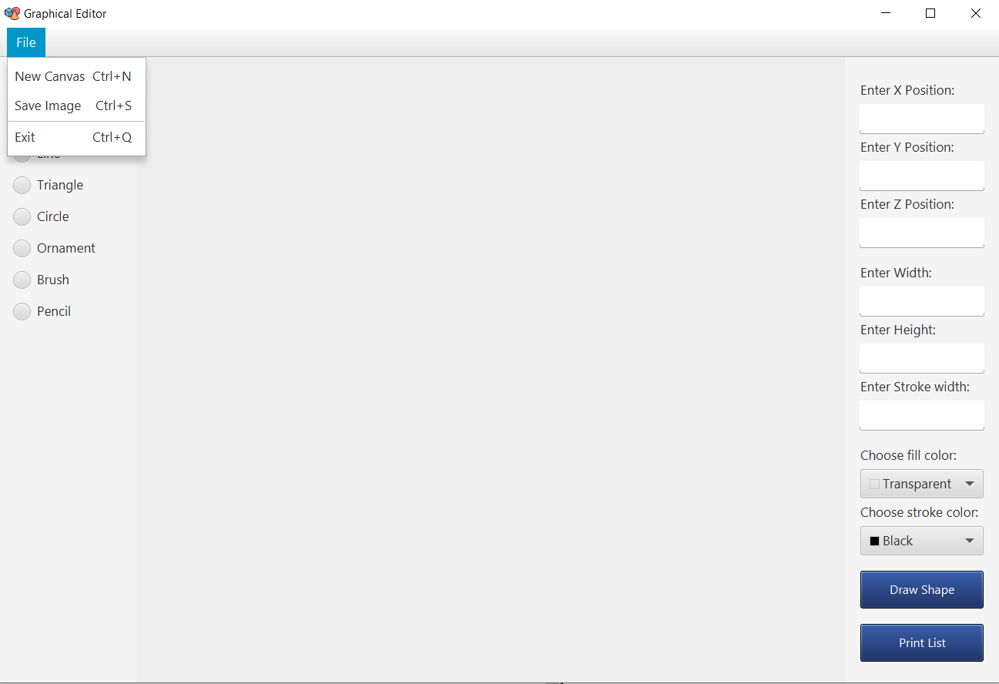
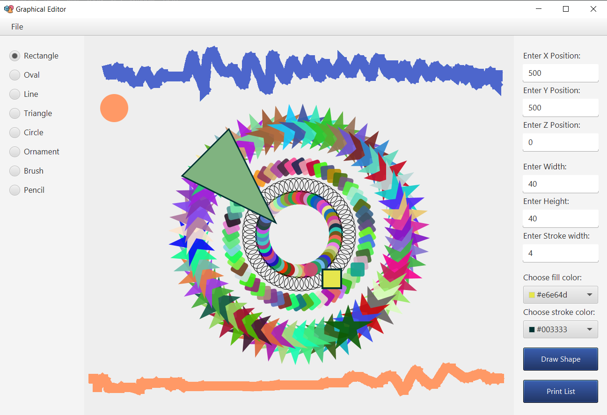

# Graphical Editor

This project was developed as a laboratory work on Software Engineering, but later grew into a unique project that contains a primitive implementation of a graphics editor, that developed using JavaFX.

## Prerequisites

1. [IntelliJ IDEA](https://www.jetbrains.com/idea/download/#section=windows)
2. [Basic knowledge in Design Patterns](https://refactoring.guru/design-patterns)

## Functionality
The graphics editor contains the following features for drawing:

- [x] Rectangles
- [x] Triangles
- [x] Ovals
- [x] Circles
- [x] Lines
- [x] Ornaments

You can also draw with:

- [x] Brush
- [x] Pencil

Other features include:

- [x] Line width selection
- [x] Choice of color of a line of a figure
- [x] Choice of color of filling of a figure
- [x] Canvas cleaning
- [x] Saving work results

**Note**: to draw a shape you need to press the `Draw shape` button, it must also be pressed when you are going to draw with a brush or pencil.

In general, everything is based on the `Composite` pattern.

## Example of project performance

    

    

